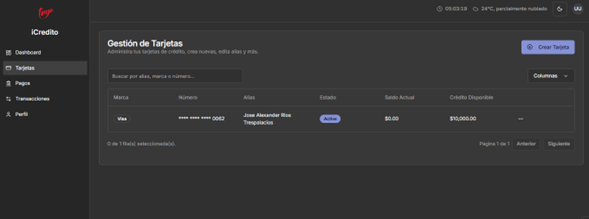
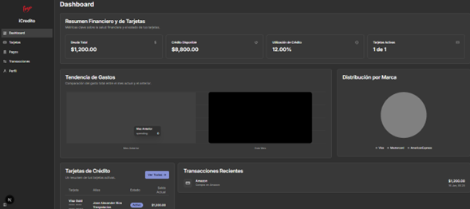
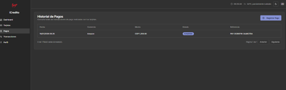

# iCredito - Frontend

Esta es la aplicación frontend para el sistema **iCredito**, una plataforma completa para la gestión de tarjetas de crédito.

La aplicación está construida con tecnologías modernas para ofrecer una experiencia de usuario rápida, responsiva y escalable.

## Tecnologías Utilizadas

-   **Framework:** [Next.js](https://nextjs.org/) (con App Router)
-   **Lenguaje:** [TypeScript](https://www.typescriptlang.org/)
-   **UI:** [ShadCN UI](https://ui.shadcn.com/)
-   **Estilos:** [Tailwind CSS](https://tailwindcss.com/)
-   **Gestión de Estado y Fetching:** [TanStack Query (React Query)](https://tanstack.com/query/latest)
-   **Formularios:** [React Hook Form](https://react-hook-form.com/) & [Zod](https://zod.dev/)

## Cómo Empezar

Para ejecutar este proyecto en tu entorno de desarrollo local, sigue estos pasos:

### Prerrequisitos

-   Node.js (v18 o superior recomendado)
-   npm o yarn
-   Asegúrate de que el **backend de iCredito (.NET API)** esté en ejecución, ya que el frontend depende de él para funcionar.

### Instalación

1.  Clona el repositorio (si aplica) o descomprime los archivos del proyecto.
2.  Abre una terminal en el directorio raíz del proyecto.
3.  Instala todas las dependencias necesarias:

    ```bash
    npm install
    ```

### Ejecución

Una vez instaladas las dependencias, puedes iniciar el servidor de desarrollo:

```bash
npm run dev
```

La aplicación se ejecutará por defecto en `http://localhost:9002`.

## Estructura de Módulos

El frontend está organizado en los siguientes módulos principales, que se encuentran dentro de la carpeta `src/app/dashboard/`:

-   **Dashboard:** Vista principal con KPIs y resúmenes.
-   **Tarjetas:** Creación, visualización y gestión de tarjetas de crédito.
-   **Pagos:** Registro y visualización de pagos realizados.
-   **Transacciones:** Historial completo de movimientos de las tarjetas.
-   **Perfil:** Gestión de la información del usuario.

## Configuración de la API

La comunicación con el backend se gestiona a través de un proxy de API de Next.js. Las llamadas del cliente se realizan a `/api/...` y el servidor de Next.js las reenvía de forma segura al backend de .NET, añadiendo el token de autenticación.

## Capturas de Pantalla




